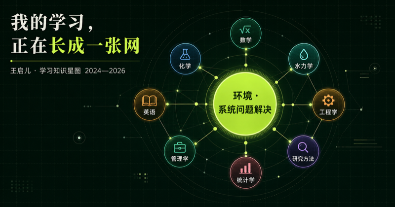

# 学习知识星图 · Learning Knowledge Atlas

> **"我的学习，正在长成一张网"** —— 2024—2026 个人学习知识体系可视化



以"环境·系统问题解决"为核心，将跨学科知识（数学、化学、水力学、英语、工程学、管理学、统计学、研究方法等）组织成可交互的知识网络，直观呈现知识之间的关联与个人学习体系的生长过程。

## 技术栈

- **Next.js / vinext** 全栈框架
- **Drizzle ORM**（Cloudflare D1 可选）
- **Sign in with ChatGPT**（可选登录，见 `app/chatgpt-auth.ts`）

## 快速开始

```bash
npm install
npm run dev      # 本地开发
npm run build    # 构建验证
```

## 项目结构

- `app/page.tsx` — 知识星图主页
- `app/chatgpt-auth.ts` — ChatGPT 登录辅助（可选）
- `db/schema.ts` — 数据模型（预留）
- `examples/d1/` — D1 示例
